Guía para padres de Sallenet
=============================================================

[TOC]

Primer inicio de sesión
---------------------------------------------------

1 - Entramos en la página web [lasallemundonuevo.sallenet.org](http://lasallemundonuevo.sallenet.org).

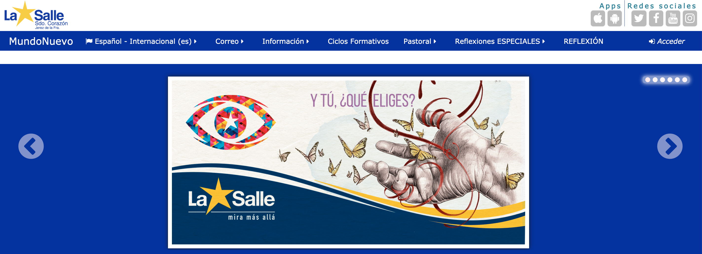

2 - Pulsamos en el botón **Acceder** arriba a la derecha.

Este curso tenemos dos opciones para iniciar sesión en la plataforma. Podemos iniciar sesión con **la cuenta de Google @lasallemundonuevo.es** o usando el **nombre y usuario de la plataforma**.

### Iniciar sesión con la cuenta de Google

**Si nunca hemos entrado** en nuestra cuenta de Google @lasallemundonuevo.es, **primero debemos acceder** a [mail.google.com](https://mail.google.com) e iniciar sesión usando nuestro correo y contraseña que nos habrán enviado a través de una comunicación. Después de aceptar las condiciones y poner una contraseña definitiva, podremos usar el correo electrónico con normalidad.

1 - Pulsamos en el botón "**@lasallemundonuevo.es**".

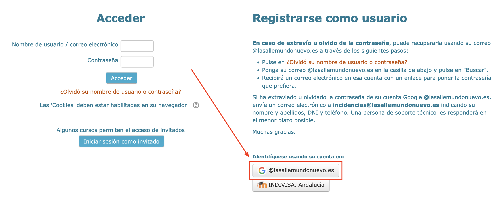

2 - Iniciamos sesión con nuestro correo **@lasallemundonuevo.es**.

La primera vez que iniciemos sesión de esta forma, nos aparecerá el siguiente mensaje:

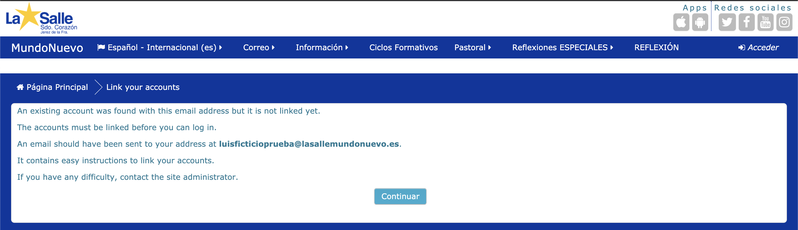

Tendremos que entrar en [mail.google.com](https://mail.google.com) con nuestra cuenta @lasallemundonuevo.es, donde veremos un nuevo mensaje con un contenido similar al siguiente:

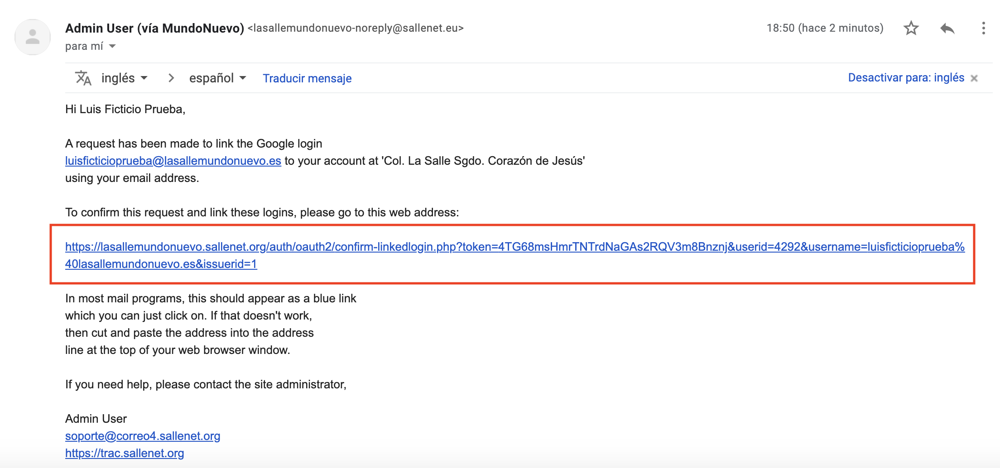

Pulsamos en el enlace y a partir de ahora podremos iniciar sesión con nuestra cuenta de Google en la plataforma sin necesidad de realizar este paso.

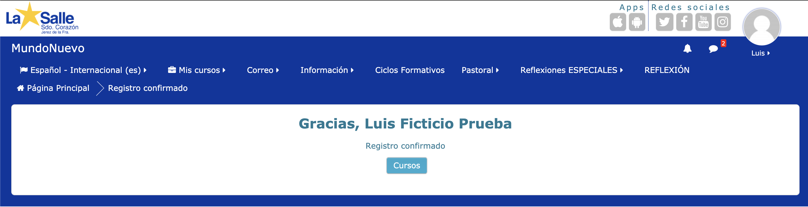

### Iniciar sesión con el usuario y contraseña de la plataforma

1 - Introducimos el nombre de usuario y la contraseña que nos han asignado. Si no lo conocemos, pulsamos el enlace [¿Olvidó su nombre de usuario o contraseña?](https://lasallemundonuevo.sallenet.org/login/forgot_password.php). Escribimos **nuestro correo electrónico @lasallemundonuevo.es** en el campo correspondiente y pulsamos en "**Buscar**".

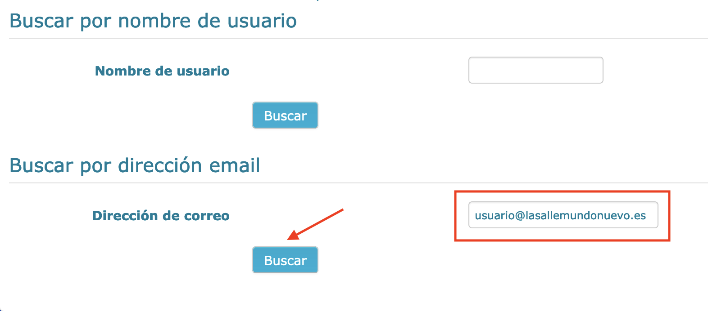

Recibiremos un mensaje en la cuenta de correo con un enlace para generar una nueva contraseña en el plazo de 30 minutos.

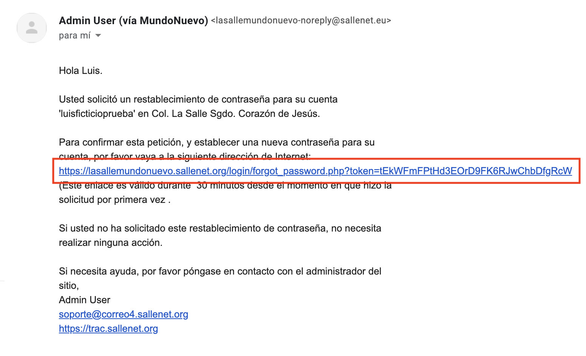

2 - La primera vez que entremos nos pedirá que cambiemos la contraseña. Ponemos en la primera casilla la **Contraseña actual** introducida anteriormente y elegimos una nueva contraseña (debe tener al menos 8 caracteres, entre ellos al menos una letra minúscula, otra mayúscula, algún número y algún caracter alfanumérico [%,&,\$]). Ponemos la nueva contraseña en los campos **Nueva contraseña** y **Nueva contraseña (de nuevo)**.

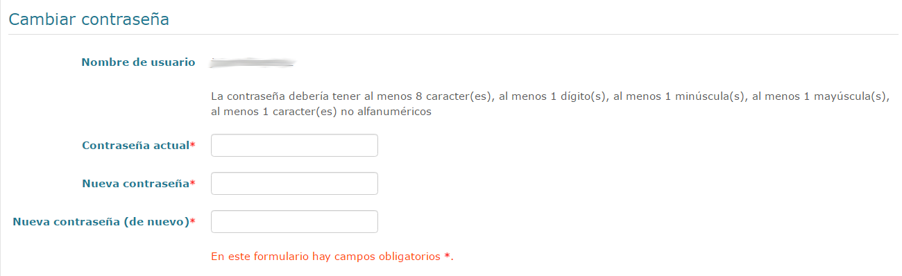

5 - Pulsamos en **Guardar cambios**.

### Establecer idioma preferido

Si queremos cambiar el idioma por defecto:

1 - Ponemos el ratón sobre nuestro nombre arriba a la derecha en la página, luego pasamos el ratón por **Preferencias** y pulsamos en **Usuario**.

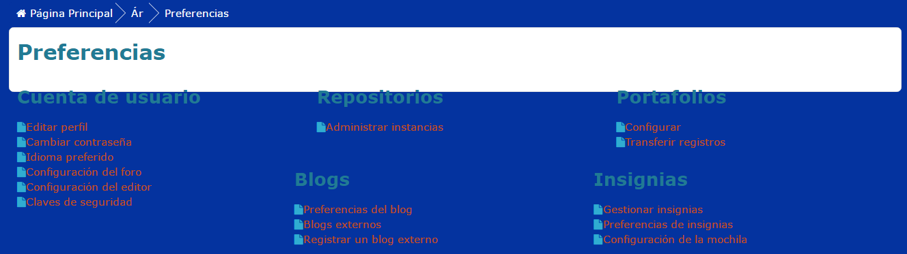

2 - Hacemos clic en **Idioma preferido**.

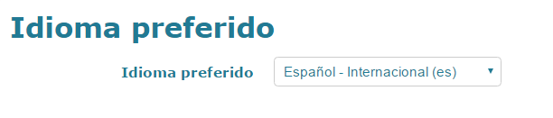

3 - Ponemos en la pestaña el idioma preferido que queramos y pulsamos en **Guardar cambios**.

Consulta de información sobre el alumno
-----------------------------------------------------------------------------------

Una vez que hemos entrado en la plataforma con nuestro nombre de usuario y nuestra contraseña, buscamos en la parte de abajo a la izquierda el bloque **Mi Sallenet** en la página principal.

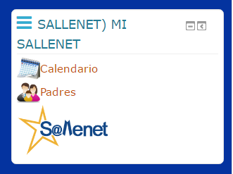

Pulsamos en **Padres** y nos aparecerán los nombres de nuestros hijos.

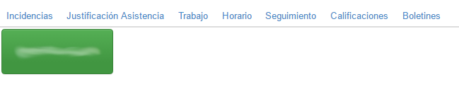

Hacemos clic en el nombre para consultar su información a través de las pestañas (“Incidencias”, “Justificación Asistencia”…).

### Consulta de calificaciones

Una vez hemos realizado los pasos del apartado anterior, únicamente tendremos que pulsar en **Seguimiento**.

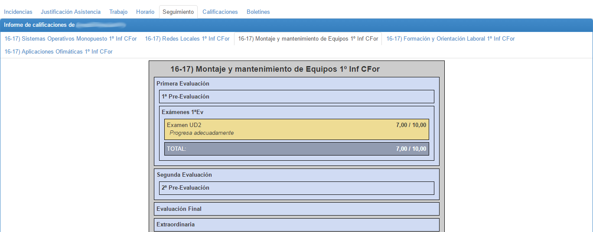

Pulsando en cada asignatura veremos las calificaciones que han puesto los profesores de dicha asignatura en la plataforma.

### Consulta de tareas y planificaciones

En el mismo menú en el que hemos consultado las calificaciones, podemos visualizar la planificación de cada asignatura y las posibles tareas pendientes para casa por día. Esta información la podemos encontrar pulsando en el apartado **Trabajo**.

### Consulta de faltas

De la misma forma que anteriormente, podemos consultar las faltas a clase de nuestro/a hijo/a pulsando en **Incidencias**.

### Acceso a boletines de notas

También tenemos disponible una pestaña "**Boletines**", en la que aparecerán los boletines de notas en PDF generados en cada evaluación o preevaluación.

Sincronizar correo electrónico con nuestro dispositivo móvil
-----------------------------

Esta opción nos permitirá recibir notificaciones de nuevos mensajes en la cuenta @lasallemundonuevo.es en nuestro móvil, al igual que recibimos las notificaciones de los mensajes recibidos en nuestro correo personal.

Presuponemos que el cliente de correo utilizado es la APP de Gmail, aunque el proceso es similar para otras aplicaciones.

1. Abrimos la aplicación **Gmail** en nuestro teléfono o tablet.
2. En la esquina superior derecha, toca tu foto de perfil.
3. Toca **"Añadir otra cuenta**" (Android) o "**Usar otra cuenta**" (iOS).
4. Elige el tipo de cuenta "**Google**".
5. Introduce tu **correo electrónico @lasallemundonuevo.es** y posteriormente tu **contraseña**.

A partir de ahora, pulsando en la foto de perfil en la esquina superior derecha, podrás altenar entre las bandejas de entrada de ambas cuentas.

APP Sallenet
-----------------------------

Podemos hacer uso de la APP Sallenet para acceder a información sobre nuestro/a hijo/a desde un teléfono móvil o tablet (Android o iOS). Para descargarla, solamente tenemos que abrir la tienda de aplicaciones y buscar “Sallenet”.

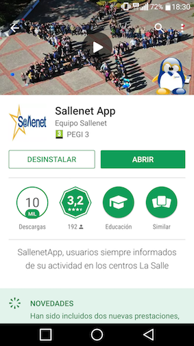

Cuando la abramos tendremos que elegir el Sector (Andalucía y Melilla) y el Centro (La Salle Sagrado Corazón Jerez).

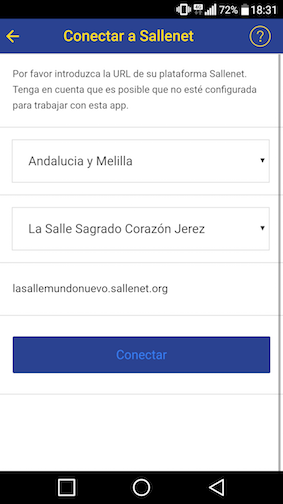

Finalmente, ponemos nuestro nombre de usuario y contraseña de la plataforma y pulsamos en “Acceder!”. Es importante recalcar que se trata del usuario y contraseña de la plataforma, diferentes al email y contraseña del correo @lasallemundonuevo.es.

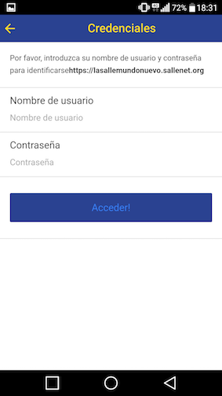

**Nota importante**: Dependiendo del dispositivo móvil utilizado, es posible que las notificaciones de Comunicaciones de la APP no funcionen correctamente. Aconsejamos sincronizar el correo electrónico @lasallemundonuevo.es con su cliente de correo favorito para recibir las notificaciones de los mensajes.

Licencia
---------------------

Material elaborado por el Equipo TIC de La Salle Sagrado Corazón de Jesús (Mundo Nuevo) de Jerez de la Frontera (Cádiz).

[equipotic@lasallemundonuevo.es](mailto:equipotic@lasallemundonuevo.es)

Licencia Creative Commons (BY-NC-SA)

